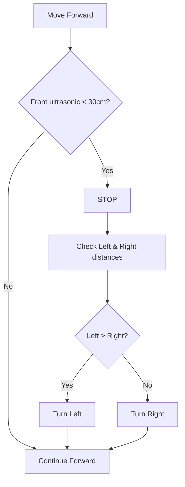

<div align="center">
  
  
  <!-- Animated IoT Signal SVG -->
  <svg width="800" height="200" viewBox="0 0 800 200" xmlns="http://www.w3.org/2000/svg">
    <rect width="800" height="200" fill="#0a0f1e" rx="20"/>
    <!-- IoT signal waves -->
    <path d="M50 100 Q75 80 100 100 Q125 80 150 100" stroke="#00e5ff" stroke-width="2" fill="none">
      <animate attributeName="opacity" values="0.3;1;0.3" dur="2s" repeatCount="indefinite"/>
    </path>
    <path d="M180 100 Q205 70 230 100 Q255 70 280 100" stroke="#00e5ff" stroke-width="2" fill="none">
      <animate attributeName="opacity" values="0.5;1;0.5" dur="1.5s" repeatCount="indefinite"/>
    </path>
    <circle cx="300" cy="100" r="30" fill="none" stroke="#ffaa44" stroke-width="3" stroke-dasharray="6,6">
      <animateTransform attributeName="transform" type="rotate" from="0 300 100" to="360 300 100" dur="4s" repeatCount="indefinite"/>
    </circle>
    <text x="300" y="105" text-anchor="middle" fill="#ffaa44" font-size="14" font-weight="bold">VC-02</text>
    <line x1="330" y1="100" x2="400" y2="100" stroke="#00e5ff" stroke-width="3" stroke-dasharray="8,4">
      <animate attributeName="stroke-dashoffset" values="0;-24" dur="0.8s" repeatCount="indefinite"/>
    </line>
    <text x="365" y="85" fill="#aaa" font-size="11">UART (115200)</text>
    <text x="365" y="130" fill="#888" font-size="10">0x01..0x0B</text>
    <!-- Arduino block -->
    <rect x="410" y="60" width="130" height="80" rx="12" fill="#1e2a4a" stroke="#66ff66" stroke-width="2"/>
    <text x="475" y="95" text-anchor="middle" fill="#66ff66" font-size="14">Arduino Uno</text>
    <text x="475" y="115" text-anchor="middle" fill="#ccc" font-size="10">L298N + Sensors</text>
    <!-- ESP32 Server block -->
    <rect x="410" y="150" width="130" height="80" rx="12" fill="#1e2a4a" stroke="#ffaa44" stroke-width="2"/>
    <text x="475" y="185" text-anchor="middle" fill="#ffaa44" font-size="14">ESP32 Server</text>
    <text x="475" y="205" text-anchor="middle" fill="#ccc" font-size="10">Steppers + Bridge</text>
    <!-- Bluetooth arrow -->
    <line x1="540" y1="190" x2="620" y2="190" stroke="#44ccff" stroke-width="3" stroke-dasharray="6,3">
      <animate attributeName="stroke-dashoffset" values="0;-18" dur="1s" repeatCount="indefinite"/>
    </line>
    <text x="580" y="175" fill="#44ccff" font-size="11">Bluetooth</text>
    <!-- ESP32 Client -->
    <rect x="630" y="150" width="130" height="80" rx="12" fill="#1e2a4a" stroke="#44ccff" stroke-width="2"/>
    <text x="695" y="185" text-anchor="middle" fill="#44ccff" font-size="14">ESP32 Client</text>
    <text x="695" y="205" text-anchor="middle" fill="#ccc" font-size="10">Light &amp; Fan</text>
    <!-- Animated IoT dots -->
    <circle cx="50" cy="180" r="4" fill="#00e5ff">
      <animate attributeName="r" values="3;6;3" dur="1.2s" repeatCount="indefinite"/>
      <animate attributeName="opacity" values="1;0.3;1" dur="1.2s" repeatCount="indefinite"/>
    </circle>
    <circle cx="80" cy="180" r="4" fill="#00e5ff">
      <animate attributeName="r" values="3;6;3" dur="1.2s" begin="0.3s" repeatCount="indefinite"/>
    </circle>
    <circle cx="110" cy="180" r="4" fill="#00e5ff">
      <animate attributeName="r" values="3;6;3" dur="1.2s" begin="0.6s" repeatCount="indefinite"/>
    </circle>
  </svg>

  <p>
    
    
    
    
  </p>
</div>

---

## 📡 Project Overview

This project transforms a standard wheelchair into a **smart, voice‑controlled mobility device** that works **offline** (no internet required). It also adds **basic home automation** – the wheelchair can control lights and a fan wirelessly via Bluetooth. With two stepper motors, the chair can convert into a **bed** (sleep position) and back to a **sitting position** using voice commands.

**Key features:**
- Offline voice recognition (VC‑02 module)
- Dual‑processor architecture: Arduino Uno (motor control & sensors) + ESP32 Server (steppers & Bluetooth bridge) + ESP32 Client (home appliances)
- Real‑time obstacle avoidance with 4 ultrasonic sensors
- Backup touch control (TTP223 pads)
- Wireless control of home light (LED) and fan (DC motor)

---

## 📦 Repository Contents

| File | Description |
|------|-------------|
| [`wheelchair_movement.ino`](./wheelchair_movement.ino) | Arduino Uno code – L298N motor control, ultrasonic sensors, touch backup |
| [`esp32_server_stepper.ino`](./esp32_server_stepper.ino) | ESP32 Server – controls two 28BYJ-48 stepper motors (bed/chair conversion) + forwards light/fan commands via Bluetooth |
| [`esp32_client_light_fan.ino`](./esp32_client_light_fan.ino) | ESP32 Client – switches a 3V LED (light) and a 5V DC motor (fan) |
| **VC-02 firmware** | Provided in `Firmware_VC02/uni_hb_m_solution/image_demo/Hummingbird-M-Production-Tool/bin/uni_app_release.bin` |

---

## 🎤 Voice Command Table

| Voice Command           | UART Hex | Action                                        |
|-------------------------|----------|-----------------------------------------------|
| “Move forward”          | `0x01`   | Wheelchair moves forward                      |
| “Move backward”         | `0x02`   | Moves backward                                |
| “Turn left”             | `0x03`   | Turns left 90° (duration configurable)        |
| “Turn right”            | `0x04`   | Turns right 90°                               |
| “Stop”                  | `0x05`   | Stops all wheel motors                        |
| “Light on”              | `0x06`   | Home light ON                                 |
| “Light off”             | `0x07`   | Home light OFF                                |
| “Fan on”                | `0x08`   | Home fan ON                                   |
| “Fan off”               | `0x09`   | Home fan OFF                                  |
| “Sleep position”        | `0x0A`   | Backrest lowers (bed mode) – stepper motor 1 |
| “Sit position”          | `0x0B`   | Backrest raises (chair mode) – stepper motor 1 |

> **Note:** You can change the voice phrases and hex codes using the VC‑02 firmware tool.

---

## 🔧 VC-02 Firmware Upload (Offline Voice Module)

Your VC‑02 module must be programmed with a custom firmware that maps voice commands to the hex codes above. The pre‑compiled firmware is located at:

```
Firmware_VC02\uni_hb_m_solution\image_demo\Hummingbird-M-Production-Tool\bin\uni_app_release.bin
```

Follow these steps to upload it:

### 🛠 Required Tools
- **Hummingbird-M Production Tool** – download from [Ai-Thinker official site](https://docs.ai-thinker.com/) (search for “Hummingbird‑M Production Tool”).
- USB‑to‑TTL adapter (e.g., CP2102, CH340) – connect to VC‑02.
- Jumper wires.

### 🔌 Hardware Connection
| VC‑02 Pin | USB‑TTL Adapter |
|-----------|-----------------|
| VCC       | 3.3V            |
| GND       | GND             |
| TX        | RX              |
| RX        | TX              |
| B0        | GND (to enter download mode) |

### 📥 Upload Procedure

1. **Open Hummingbird-M Production Tool** (run as administrator).
2. **Select COM port** of your USB‑TTL adapter.
3. **Baud rate** → `115200`.
4. **Load firmware** – click “Load bin” and select:
   ```
   .../Hummingbird-M-Production-Tool/bin/uni_app_release.bin
   ```
5. **Enable “Download mode”** on VC‑02 – connect `B0` pin to `GND`.
6. **Power cycle** the VC‑02 (disconnect and reconnect VCC).
7. In the tool, click **“Download”**.
8. Wait for progress to reach 100% (about 30 seconds).
9. **Disconnect B0** from GND and reset the VC‑02.

> ✅ After successful upload, the VC‑02 will automatically send `0x01` when you say “Move forward”, etc. Test with a serial monitor (115200 baud).

---

## 🔌 Complete Wiring Diagrams

### 1. Shared UART Bus (VC‑02 → Arduino Uno & ESP32 Server)

| VC‑02 Pin | Connected To                     | Voltage Level |
|-----------|----------------------------------|---------------|
| TX        | Arduino Pin 0 (RX)               | 5V (use level shifter) |
| TX (also) | ESP32 GPIO16 (RX2)               | 3.3V (direct) |

> **Important:** Use a **voltage divider** (1kΩ + 2kΩ) between VC‑02 TX and ESP32 RX2 to step down 5V → 3.3V. The Arduino can accept 5V directly.

### 2. Arduino Uno → L298N Motor Driver

| L298N Pin | Arduino Pin |
|-----------|-------------|
| IN1       | 8           |
| IN2       | 9           |
| IN3       | 10          |
| IN4       | 11          |
| ENA       | 5V (or PWM) |
| ENB       | 5V (or PWM) |
| +12V      | 12V battery |
| GND       | Common GND  |

### 3. Ultrasonic Sensors (HC‑SR04)

| Position | Trig Pin | Echo Pin |
|----------|----------|----------|
| Front    | 2        | 3        |
| Back     | 4        | 5        |
| Left     | 6        | 7        |
| Right    | 12       | 13       |

### 4. TTP223 Touch Sensors (Backup)

| Touch Pad | Arduino Analog Pin |
|-----------|--------------------|
| Front     | A0                 |
| Back      | A1                 |
| Left      | A2                 |
| Right    | A3                 |

### 5. ESP32 Server (on wheelchair)

| Component                  | ESP32 GPIO |
|----------------------------|------------|
| UART RX2 (from VC‑02 TX)   | 16         |
| Stepper 1 (Backrest) IN1‑4 | 18,19,21,22 |
| Stepper 2 (Seat) IN1‑4      | 25,26,32,33 |

### 6. ESP32 Client (in home)

| Appliance | GPIO | Driver |
|-----------|------|--------|
| LED (light) | 26 | 220Ω resistor |
| 5V DC motor (fan) | 27 | Transistor (2N2222) or relay |

---

## 🧠 Obstacle Avoidance Logic (Animated Flow)



- When moving **backward**, only the rear sensor is checked – obstacle → **STOP**.
- The system checks obstacles **only while moving** to avoid false triggers.

---

## 📜 Code Explanation (Snippets)

### Arduino Uno – `wheelchair_movement.ino`
- Reads UART commands (0x01‑0x05) and touch sensors.
- Drives L298N with `moveForward()`, `turnLeft()`, etc.
- `handleForwardObstacle()` stops the chair and chooses a free direction.

### ESP32 Server – `esp32_server_stepper.ino`
- Listens on `Serial2` for all commands.
- Forwards `0x06`‑`0x09` to Bluetooth client.
- Directly runs steppers on `0x0A` and `0x0B`.

### ESP32 Client – `esp32_client_light_fan.ino`
- Bluetooth slave that receives only `0x06`‑`0x09`.
- Controls GPIO26 (LED) and GPIO27 (motor).

---

## 🚀 Quick Setup (5 Steps)

1. **Upload VC‑02 firmware** using Hummingbird‑M Tool (see above).
2. **Upload Arduino code** – disconnect VC‑02 TX from pin 0, then upload `wheelchair_movement.ino`.
3. **Upload ESP32 Server** code to the ESP32 mounted on the wheelchair.
4. **Upload ESP32 Client** code to the ESP32 in your home.
5. **Power everything** – wheelchair from 12V battery (with 5V regulators), client via USB. The server will auto‑connect to the client (ensure client is on first).

---

## 🎨 Customisation Tips

- **Change obstacle distance** – edit `OBSTACLE_THRESHOLD` in Arduino code (default 30 cm).
- **Adjust turn duration** – modify `TURN_DURATION` (in milliseconds).
- **Stepper calibration** – change `backrestSleepSteps` (in server code) to match your mechanical travel.
- **Add limit switches** – to prevent stepper over‑travel.

---

## 📜 License

MIT – free to use, modify, and share. Attribution is appreciated but not required.

---

## 🤝 Contributing

Pull requests, bug reports, and feature suggestions are welcome. Let’s make mobility smarter together.

---

<div align="center">
  <svg width="300" height="60" viewBox="0 0 300 60">
    <rect width="300" height="60" fill="#0d1117" rx="30"/>
    <text x="150" y="35" text-anchor="middle" fill="#00e5ff" font-size="16" font-weight="bold">❤️ Made with IoT & Open Source ❤️</text>
  </svg>
  <br/>
  
  
</div>

---

