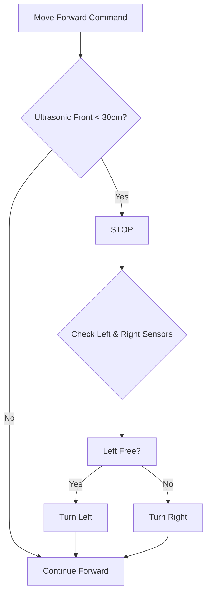

<!-- 
  IoT Voice-Controlled Wheelchair with Home Automation
  Animated SVG + Modern README
-->

<div align="center">
  
  <br/>
  
  <!-- Animated SVG Banner -->
  <svg width="800" height="200" viewBox="0 0 800 200" xmlns="http://www.w3.org/2000/svg">
    <rect width="800" height="200" fill="#0a0f1e" rx="20"/>
    <circle cx="100" cy="100" r="40" fill="#2c3e66" stroke="#00b8ff" stroke-width="2">
      <animate attributeName="r" values="38;42;38" dur="2s" repeatCount="indefinite"/>
      <animate attributeName="fill" values="#2c3e66;#1e2a4a;#2c3e66" dur="3s" repeatCount="indefinite"/>
    </circle>
    <text x="100" y="105" text-anchor="middle" fill="#00b8ff" font-size="14" font-family="monospace">VOICE</text>
    
    <line x1="140" y1="100" x2="220" y2="100" stroke="#00b8ff" stroke-width="3" stroke-dasharray="5,5">
      <animate attributeName="stroke-dashoffset" values="0;-20" dur="1s" repeatCount="indefinite"/>
    </line>
    <text x="180" y="85" fill="#aaa" font-size="12">UART (0x01..0x0B)</text>
    
    <rect x="220" y="60" width="120" height="80" rx="10" fill="#1e2a4a" stroke="#ffaa44" stroke-width="2">
      <animate attributeName="stroke" values="#ffaa44;#ffcc66;#ffaa44" dur="2s" repeatCount="indefinite"/>
    </rect>
    <text x="280" y="95" text-anchor="middle" fill="#ffaa44" font-size="14" font-weight="bold">ESP32</text>
    <text x="280" y="115" text-anchor="middle" fill="#ccc" font-size="11">SERVER</text>
    
    <rect x="220" y="150" width="120" height="40" rx="8" fill="#1e2a4a" stroke="#66ff66" stroke-width="2"/>
    <text x="280" y="175" text-anchor="middle" fill="#66ff66" font-size="12">STEPPERS</text>
    
    <line x1="340" y1="100" x2="420" y2="100" stroke="#00b8ff" stroke-width="3" stroke-dasharray="5,5">
      <animate attributeName="stroke-dashoffset" values="0;-20" dur="1.5s" repeatCount="indefinite"/>
    </line>
    <text x="380" y="85" fill="#aaa" font-size="12">Bluetooth</text>
    
    <rect x="420" y="60" width="120" height="80" rx="10" fill="#1e2a4a" stroke="#44ffaa" stroke-width="2"/>
    <text x="480" y="95" text-anchor="middle" fill="#44ffaa" font-size="14">ESP32</text>
    <text x="480" y="115" text-anchor="middle" fill="#ccc" font-size="11">CLIENT</text>
    
    <rect x="420" y="150" width="120" height="40" rx="8" fill="#1e2a4a" stroke="#ff6666" stroke-width="2"/>
    <text x="480" y="175" text-anchor="middle" fill="#ff6666" font-size="12">LIGHT / FAN</text>
    
    <line x1="140" y1="100" x2="220" y2="170" stroke="#66ff66" stroke-width="2" stroke-dasharray="4,4"/>
    <text x="170" y="190" fill="#aaa" font-size="10">Arduino Uno</text>
    <text x="170" y="205" fill="#aaa" font-size="10">(Motors + Sensors)</text>
    
    <circle cx="550" cy="30" r="5" fill="#00ffcc">
      <animate attributeName="opacity" values="1;0.2;1" dur="1s" repeatCount="indefinite"/>
    </circle>
    <circle cx="600" cy="30" r="5" fill="#00ffcc">
      <animate attributeName="opacity" values="0.2;1;0.2" dur="1.5s" repeatCount="indefinite"/>
    </circle>
    <text x="580" y="50" fill="#888" font-size="10">IoT Mesh</text>
  </svg>

  <p>
    
    
    
    
  </p>
</div>

---

## 🧩 System Overview

**An intelligent wheelchair** that listens to your voice **offline**, avoids obstacles automatically, and can even control home appliances wirelessly. It also **converts into a bed** with two stepper motors – all via voice commands.

### 🔁 Data Flow
```
Voice → VC-02 → (UART) → Arduino Uno (movement + sensors)
                    ↘
                     ESP32 Server → (Bluetooth) → ESP32 Client (light/fan)
                                    ↘ (direct) → Stepper motors (backrest/seat)
```

---

## 🎥 Animated Block Diagram (SVG)

<svg width="100%" height="500" viewBox="0 0 900 500" xmlns="http://www.w3.org/2000/svg" style="background:#0d1117; border-radius:20px; font-family:sans-serif;">
  
  <text x="450" y="40" text-anchor="middle" fill="#00b8ff" font-size="24" font-weight="bold">🚀 Hardware & Communication Flow</text>
  
  <rect x="30" y="80" width="160" height="100" rx="15" fill="#1f2a44" stroke="#ff9933" stroke-width="2"/>
  <text x="110" y="120" text-anchor="middle" fill="#ff9933" font-size="16" font-weight="bold">VC-02</text>
  <text x="110" y="140" text-anchor="middle" fill="#ccc" font-size="12">Voice Module</text>
  <text x="110" y="160" text-anchor="middle" fill="#aaa" font-size="10">(Offline, UART)</text>
  
  <line x1="190" y1="130" x2="290" y2="130" stroke="#00b8ff" stroke-width="3" marker-end="url(#arrow)"/>
  <text x="240" y="115" text-anchor="middle" fill="#00b8ff" font-size="11">UART (115200)</text>
  <text x="240" y="150" text-anchor="middle" fill="#aaa" font-size="10">0x01..0x0B</text>
  
  <circle cx="300" cy="130" r="8" fill="#ffcc00"/>
  <line x1="300" y1="130" x2="400" y2="80" stroke="#66ff66" stroke-width="2" marker-end="url(#arrow)"/>
  <line x1="300" y1="130" x2="400" y2="180" stroke="#66ff66" stroke-width="2" marker-end="url(#arrow)"/>
  
  <rect x="410" y="50" width="180" height="100" rx="12" fill="#2a3a5e" stroke="#66ff66" stroke-width="2"/>
  <text x="500" y="85" text-anchor="middle" fill="#66ff66" font-size="16">Arduino Uno</text>
  <text x="500" y="105" text-anchor="middle" fill="#ccc" font-size="11">L298N Motor Driver</text>
  <text x="500" y="125" text-anchor="middle" fill="#ccc" font-size="11">4x Ultrasonic + Touch</text>
  
  <rect x="410" y="160" width="180" height="100" rx="12" fill="#2a3a5e" stroke="#ffaa44" stroke-width="2"/>
  <text x="500" y="195" text-anchor="middle" fill="#ffaa44" font-size="16">ESP32 Server</text>
  <text x="500" y="215" text-anchor="middle" fill="#ccc" font-size="11">Stepper Control</text>
  <text x="500" y="235" text-anchor="middle" fill="#ccc" font-size="11">Bluetooth Bridge</text>
  
  <line x1="590" y1="200" x2="690" y2="200" stroke="#ffaa44" stroke-width="2" stroke-dasharray="5,3" marker-end="url(#arrow)"/>
  <text x="640" y="185" fill="#ffaa44" font-size="10">Direct GPIO</text>
  <rect x="700" y="170" width="150" height="60" rx="10" fill="#3a2a3e" stroke="#ff88aa" stroke-width="1.5"/>
  <text x="775" y="195" text-anchor="middle" fill="#ff88aa" font-size="12">28BYJ-48</text>
  <text x="775" y="215" text-anchor="middle" fill="#ccc" font-size="10">Backrest & Seat</text>
  
  <path d="M 600 220 Q 750 280 700 360" stroke="#44ccff" stroke-width="2" fill="none" stroke-dasharray="8,4" marker-end="url(#arrow)"/>
  <text x="680" y="300" fill="#44ccff" font-size="11">Bluetooth Serial</text>
  
  <rect x="580" y="360" width="180" height="100" rx="12" fill="#2a3a5e" stroke="#44ccff" stroke-width="2"/>
  <text x="670" y="395" text-anchor="middle" fill="#44ccff" font-size="16">ESP32 Client</text>
  <text x="670" y="415" text-anchor="middle" fill="#ccc" font-size="11">LED (Light)</text>
  <text x="670" y="435" text-anchor="middle" fill="#ccc" font-size="11">DC Motor (Fan)</text>
  
  <defs>
    <marker id="arrow" markerWidth="10" markerHeight="10" refX="9" refY="3" orient="auto" markerUnits="strokeWidth">
      <path d="M0,0 L0,6 L9,3 z" fill="#fff"/>
    </marker>
  </defs>
  
  <circle cx="300" cy="130" r="12" fill="none" stroke="#ffcc00" stroke-width="2">
    <animate attributeName="r" values="12;20;12" dur="1.5s" repeatCount="indefinite"/>
    <animate attributeName="opacity" values="1;0;1" dur="1.5s" repeatCount="indefinite"/>
  </circle>
  
  <circle cx="500" cy="210" r="8" fill="none" stroke="#ffaa44" stroke-width="2">
    <animate attributeName="r" values="8;15;8" dur="2s" repeatCount="indefinite"/>
  </circle>
</svg>

---

## 🔌 Complete Wiring Guide

### 1. VC‑02 to Arduino Uno & ESP32 Server (Shared UART)

| VC‑02 Pin | Connected To          | Note                                 |
|-----------|-----------------------|--------------------------------------|
| VCC       | 5V (regulated)        | Minimum 500mA                        |
| GND       | Common GND            |                                      |
| TX        | Arduino Pin 0 (RX)    | Use voltage divider (5V→3.3V) to ESP32 |
|           | ESP32 GPIO16 (RX2)    |                                      |

> ⚠️ Disconnect VC‑02 TX when uploading code to Arduino.

### 2. Arduino Uno → L298N Motor Driver

| L298N Pin | Arduino Pin |
|-----------|-------------|
| IN1       | 8           |
| IN2       | 9           |
| IN3       | 10          |
| IN4       | 11          |
| ENA       | 5V (or PWM) |
| ENB       | 5V (or PWM) |

Power L298N with **12V** (motors) and its 5V output can power Arduino (optional).

### 3. Ultrasonic Sensors (HC‑SR04)

| Sensor Position | Trig Pin | Echo Pin |
|----------------|----------|----------|
| Front          | 2        | 3        |
| Back           | 4        | 5        |
| Left           | 6        | 7        |
| Right          | 12       | 13       |

### 4. TTP223 Touch Sensors (Backup)

| Touch Pad | Arduino Analog Pin |
|-----------|--------------------|
| Front     | A0                 |
| Back      | A1                 |
| Left      | A2                 |
| Right     | A3                 |

### 5. ESP32 Server (on wheelchair)

| Component            | ESP32 GPIO |
|----------------------|------------|
| VC‑02 RX2 (from VC‑02 TX) | 16 (RX2)   |
| Stepper 1 (Backrest) IN1‑IN4 | 18,19,21,22 |
| Stepper 2 (Seat) IN1‑IN4     | 25,26,32,33 |

### 6. ESP32 Client (in home)

| Appliance | GPIO | Driver Required |
|-----------|------|------------------|
| Light (LED) | 26 | 220Ω resistor |
| Fan (5V DC) | 27 | Transistor (2N2222) or relay |

---

## 🧠 Obstacle Avoidance Logic



While **moving backward**, only the rear sensor is checked: obstacle → **STOP**.

---

## 📦 Repository Files

| File | Description |
|------|-------------|
| [`Arduino_sketch_v1.0.ino`](./Arduino_sketch_v1.0/Arduino_sketch_v1.0.ino) | Arduino Uno code – motors, sensors, touch backup |
| [`ESP_Server_v1.1.ino`](./ESP_Server_v1.1/ESP_Server_v1.1.ino) | ESP32 Server – stepper control + Bluetooth forward |
| [`ESP_Client_v1.1.ino`](./ESP_Client_v1.1/ESP_Client_v1.1.ino) | ESP32 Client – light & fan switching |

---

## 🎤 Voice Command Table

| Voice Command           | UART Hex | Action |
|-------------------------|----------|--------|
| “Move forward”          | `0x01`   | Wheelchair moves forward |
| “Move backward”         | `0x02`   | Moves backward |
| “Turn left”             | `0x03`   | Turns left |
| “Turn right”            | `0x04`   | Turns right |
| “Stop”                  | `0x05`   | Stops all motors |
| “Light on”              | `0x06`   | Home light ON |
| “Light off”             | `0x07`   | Home light OFF |
| “Fan on”                | `0x08`   | Home fan ON |
| “Fan off”               | `0x09`   | Home fan OFF |
| “Sleep position”        | `0x0A`   | Backrest lowers → bed mode |
| “Sit position”          | `0x0B`   | Backrest raises → chair mode |

> You can retrain the VC‑02 with your own voice using the Ai‑Thinker Voice Platform.

---

## 🛠️ Setup in 5 Minutes

1. **Clone the repo**  
   ```bash
   git clone https://github.com/your-username/iot-voice-wheelchair.git
   ```

2. **Upload firmware to VC‑02** using USB‑TTL (map hex codes to phrases).

3. **Upload `Arduino_sketch_v1.0.ino`** to Arduino Uno (disconnect VC‑02 TX first).

4. **Upload `ESP_Server_v1.1.ino`** to the ESP32 on the wheelchair.

5. **Upload `ESP_Client_v1.1.ino`** to the ESP32 in your home.

6. **Power** the wheelchair from a 12V battery (with 5V regulators) and the client ESP32 via USB.

7. **Test** voice commands. The server ESP32 will auto‑pair with the client (ensure client is powered first).

---

## 🎨 Customisation Tips

- **Change stepper step count** – modify `backrestSleepSteps` in server code based on your chair mechanism.
- **Add limit switches** to stepper motors to prevent over‑travel.
- **Improve obstacle detection** – adjust `OBSTACLE_THRESHOLD` (default 30 cm).
- **Use PWM for speed control** – connect ENA/ENB to PWM pins on Arduino.

---

## 📜 License

MIT – free to use, modify, and share.

---

## 💬 Show Your Support

If this project helps you, give it a ⭐ and share it with makers and wheelchair users.

<div align="center">
  <svg width="200" height="50" viewBox="0 0 200 50">
    <rect width="200" height="50" fill="#0d1117" rx="25"/>
    <text x="100" y="32" text-anchor="middle" fill="#00b8ff" font-size="16">❤️ Made with IoT ❤️</text>
  </svg>
</div>
