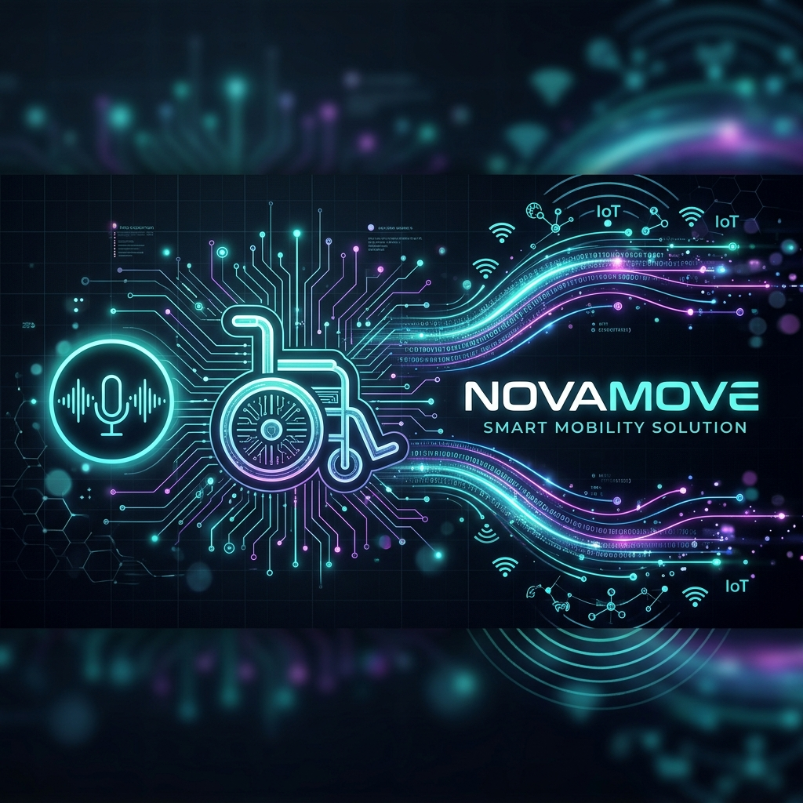

# NovaMove 🦼✨

<div align="center">
  

  <p><em>A Smart, Voice-Controlled Wheelchair Navigation and Wireless IoT Smart-Home Actuation System</em></p>

  <!-- Modern Tech Badges -->
  
  
  
  
  
</div>

---

## 📖 Project Overview

**NovaMove** is a next-generation assistive technology suite combining voice-controlled robotics with smart home automation. The system leverages an offline **VC-02 Speech Recognition Module** to receive and broadcast commands across an array of microcontrollers:
1. **Arduino Uno**: Directs chassis movement (L298N H-Bridge) and automates collision avoidance through real-time distance telemetry (HC-SR04).
2. **ESP32 Server (Wheelchair Hub)**: Drives mechanical adjustments (Stepper motors for sleep/sit recline) and forwards environmental commands.
3. **ESP32 Client (Smart Home Hub)**: Receives relayed Bluetooth signals from the server to toggle home appliances (lights, fans) hands-free.

---

## ⚡ System Connection & Data Flow

Below is the live system architecture illustrating how voice commands broadcast to controllers, how telemetry feeds into the obstacle avoidance loop, and how commands relay wirelessly to appliances:

<div align="center">
  
</div>

---

## 🔌 Electronics & Wiring Guide

To build NovaMove, wire your modules according to the pin mapping tables below.

### 1. Arduino Uno: Chassis Navigation & Obstacle Avoidance

> [!WARNING]  
> **Critical Pin Conflict Detected in Stock Sketch:**  
> In the standard sketch, **Pin 5** is assigned to both `ENA` (Motor Speed) and `ECHO_BACK` (Rear Sensor Echo), and **Pin 6** is assigned to `ENB` (Motor Speed) and `TRIG_LEFT` (Left Sensor Trigger). Running this layout directly causes electrical cross-talk and telemetry failure.
> 
> **How to Fix:** We recommend re-routing the L298N Enable pins to Analog Pins **A4** (ENA) and **A5** (ENB) configured as digital outputs. Update the sketch defines as follows:
> ```cpp
> #define ENA A4  // Re-routed from pin 5
> #define ENB A5  // Re-routed from pin 6
> ```

#### DC Motor Driver (L298N) Connections
| L298N Pin | Arduino Pin | Description | Color/Wiring Note |
| :--- | :--- | :--- | :--- |
| **ENA** | `Pin A4` *(Recommended)* | Left Motor PWM Speed Control | Enable jumper removed |
| **ENB** | `Pin A5` *(Recommended)* | Right Motor PWM Speed Control | Enable jumper removed |
| **IN1** | `Pin 8` | Left Motor Direction 1 | Connects to Arduino Digital IO |
| **IN2** | `Pin 9` | Left Motor Direction 2 | Connects to Arduino Digital IO |
| **IN3** | `Pin 10` | Right Motor Direction 1 | Connects to Arduino Digital IO |
| **IN4** | `Pin 11` | Right Motor Direction 2 | Connects to Arduino Digital IO |
| **VCC** | `External 12V` | High voltage motor power supply | Connect to battery positive |
| **GND** | `Common GND` | Common ground rail | Connects to Arduino GND |

#### Ultrasonic Sensors (HC-SR04) & Touch Controls
| Peripheral | Trig Pin | Echo / Touch Pin | Power Pin | Description |
| :--- | :--- | :--- | :--- | :--- |
| **Front Sensor** | `Pin 2` | `Pin 3` | `5V` / `GND` | Forward-looking range finder |
| **Back Sensor** | `Pin 4` | `Pin 5` | `5V` / `GND` | Reverse-looking range finder |
| **Left Sensor** | `Pin 6` | `Pin 7` | `5V` / `GND` | Left-looking range finder |
| **Right Sensor** | `Pin 12` | `Pin 13` | `5V` / `GND` | Right-looking range finder |
| **Touch Front** | — | `Pin A0` | `5V` / `GND` | Tactile bumper sensor (Front) |
| **Touch Back** | — | `Pin A1` | `5V` / `GND` | Tactile bumper sensor (Back) |
| **Touch Left** | — | `Pin A2` | `5V` / `GND` | Tactile bumper sensor (Left) |
| **Touch Right** | — | `Pin A3` | `5V` / `GND` | Tactile bumper sensor (Right) |

---

### 2. ESP32 Server: Wheelchair Hub (Voice & Actuation)

The ESP32 Server listens to the VC-02 module via its hardware serial port (`UART2`), drives two independent ULN2003 stepper driver arrays to adjust the wheelchair posture, and acts as the Bluetooth Master to control the home environment.

#### VC-02 UART Connection
| VC-02 Module Pin | ESP32 Server Pin | Description |
| :--- | :--- | :--- |
| **TXD** | `GPIO 16 (RX2)` | Serial transmit from VC-02 |
| **RXD** | `GPIO 17 (TX2)` | Serial receive (Optional) |
| **GND** | `GND` | Common Ground |
| **VCC** | `5V` | System 5V Supply |

> [!NOTE]  
> The VC-02 TX wire can also be spliced in parallel to the Arduino Uno's **RX (Pin 0)**. This allows a single broadcast command to reach both microcontrollers simultaneously.

#### Actuator Stepper Motors (28BYJ-48 via ULN2003)
| Stepper Motor | Driver Input Pins (IN1 - IN4) | ESP32 Pins | Description |
| :--- | :--- | :--- | :--- |
| **Backrest Motor** | IN1, IN2, IN3, IN4 | `GPIO 18, 19, 21, 22` | Backrest angle adjustments |
| **Seat Motor** | IN1, IN2, IN3, IN4 | `GPIO 25, 26, 32, 33` | Seat height / tilt adjustment |

---

### 3. ESP32 Client: Smart Home Controller

This ESP32 module runs as a Bluetooth SPP (Serial Port Profile) slave, accepting commands from the Server to drive relays connected to household electronics.

#### Relay / Driver Actuation Pins
| Connected Appliance | ESP32 GPIO Pin | Trigger State | Description |
| :--- | :--- | :--- | :--- |
| **Light Switch** | `GPIO 26` | `HIGH` (ON) / `LOW` (OFF) | Drives Relay for Room Lighting |
| **Fan Switch** | `GPIO 27` | `HIGH` (ON) / `LOW` (OFF) | Drives Relay for Room Fan |

---

## 🗣️ Command Control Protocol (HEX Map)

The VC-02 Voice Module is configured to emit the following hexadecimal command tokens over UART. Below is how each controller interprets them:

| Command Token | Action / Target | Primary Controller | Operation Executed |
| :---: | :--- | :--- | :--- |
| `0x01` | **Move Forward** | Arduino Uno | Activates IN1 & IN3 (HIGH) |
| `0x02` | **Move Backward** | Arduino Uno | Activates IN2 & IN4 (HIGH) |
| `0x03` | **Turn Left** | Arduino Uno | Spills differential drive for Left spin |
| `0x04` | **Turn Right** | Arduino Uno | Spills differential drive for Right spin |
| `0x05` | **Stop Motors** | Arduino Uno | Sets all driver inputs to LOW |
| `0x06` | **Light ON** | ESP32 Client | Relayed via BT; sets GPIO 26 to HIGH |
| `0x07` | **Light OFF** | ESP32 Client | Relayed via BT; sets GPIO 26 to LOW |
| `0x08` | **Fan ON** | ESP32 Client | Relayed via BT; sets GPIO 27 to HIGH |
| `0x09` | **Fan OFF** | ESP32 Client | Relayed via BT; sets GPIO 27 to LOW |
| `0x0A` | **Sleep Position**| ESP32 Server | Runs steppers forward to recline backrest |
| `0x0B` | **Sit Position** | ESP32 Server | Runs steppers in reverse to restore sit |

---

## 📂 Codebase Architecture

The project contains three dedicated sketch directories designed to run concurrently:

```bash
NovaMove/
├── Arduino_sketch_v1.0/
│   └── Arduino_sketch_v1.0.ino   # Drive controller + Obstacle avoidance + Touch backup
├── ESP_Server_v1.1/
│   └── ESP_Server_v1.1.ino       # Stepper recline drive + BT Master (Broadcaster)
├── ESP_Client_v1.1/
│   └── ESP_Client_v1.1.ino       # Smart appliance relays + BT Slave (Receiver)
└── assets/
    ├── novamove_banner.png       # Graphic Title Banner
    └── system_architecture.svg   # Animated System Topology Diagram
```

---

## 🚀 Getting Started

### 1. Hardware Checklist
- [ ] 1x Arduino Uno R3 or compatible
- [ ] 2x ESP32 NodeMCU Development Modules
- [ ] 1x AI-Thinker VC-02 Voice Recognition Module
- [ ] 1x L298N Dual H-Bridge Motor Driver
- [ ] 4x HC-SR04 Ultrasonic Range Sensors
- [ ] 4x Digital Touch Sensor Plates
- [ ] 2x 28BYJ-48 Stepper Motors with ULN2003 Drivers
- [ ] 2x Optocoupled 5V Relay Modules (or transistors for LED/DC Fan demo)

### 2. Software & Build Setup
1. **Arduino IDE Installation:** Ensure you have the [Arduino IDE](https://www.arduino.cc/en/software) loaded on your PC.
2. **Library Installation:** Open the Library Manager (`Ctrl + Shift + I`) and install:
   - **NewPing** (for fast multi-ultrasonic pinging)
   - **Stepper** (built-in stepper motor library)
3. **Compile and Upload:**
   - Upload `Arduino_sketch_v1.0.ino` to your Arduino Uno.
   - Upload `ESP_Server_v1.1.ino` to the Server ESP32.
   - Upload `ESP_Client_v1.1.ino` to the Client ESP32.
4. **Bluetooth Pairing:** The ESP32 Server is programmed to search automatically for an SPP target named `"ESP32_Client"`. Once powered, they will establish connection indicated by the UART log `Connected to Client ESP32`.
